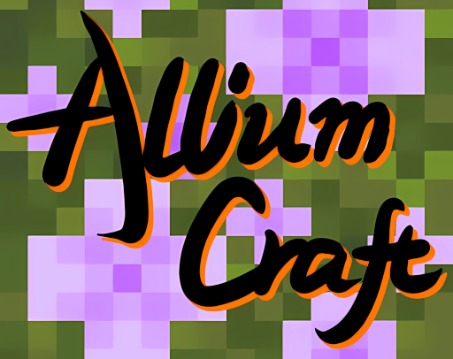

# AlliumCraft - 绒球葱工艺

> 那一晚，绒球葱和红石都喝醉了...\
> 

## 简介

- 绒球葱工艺，Reak的随意作品，受b站up主＂我是绵羊Yang_g＂启发而作，[原视频](https://www.bilibili.com/video/BV1qoRLYHEd1)背后是一段有趣的故事。
- 此Mod加入了绒球葱信号系统，类比于原版的红石系统，有着相同的交互逻辑，但与红石信号独立，实际上，本Mod最初是为了解决原版红石布线不佳导致的串信号而编写的。
- 此Mod的代码部分由Reak编写，物品纹理文件由Sheep-realms的开源项目[Allium-Effect](https://github.com/sheep-realms/Allium-Effect/releases
)提供，本Mod和原纹理资源包均以CC BY-NC-SA 4.0
协议授权。

## 内容

### 物品/方块

- [ ] Muilla葱球绒：生成于繁花森林的罕见花朵，能够酿造幸运药水
- [ ] Allium Dust绒球葱粉：类比于红石线，是绒球葱网络的基本材料，可用绒球葱或绒球葱花簇合成
- [ ] Allium Petals绒球葱花簇：生成于繁花森林的花簇，同一方块内可叠加4个，可用于合成绒球葱粉
- [ ] (Deepslate)Allium Ore(深层)绒球葱矿石：就当它是红石矿石吧！
- [ ] Allium Block绒球葱方块：就当它是红石块吧！
- [ ] Allium Comparator绒球葱比较器：就当它是红石比较器吧！
- [ ] Allium Repeator绒球葱中继器：就当它是红石中继器吧！
- [ ] Allium & Redstone Switch绒球葱&红石转换器:拥有两种模式，分别将绒球葱信号/红石信号转化成另一种信号，信号强度不变
- [ ] Allium Torch绒球葱火把：就当它是红石火把吧！
- [ ] Allium Lamp绒球葱灯：一种照明灯具

### 世界生成
- [ ] FlowersNursery花圃：生成于除沙漠雪地等群系外的一切位置，其中能找到包含了所有种类的花的木桶

## 未来计划
- [ ] 将支持neoForge
- [ ] 将支持更多Minecraft版本
